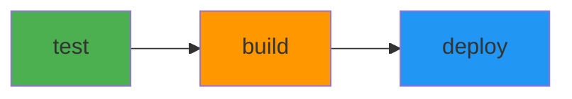
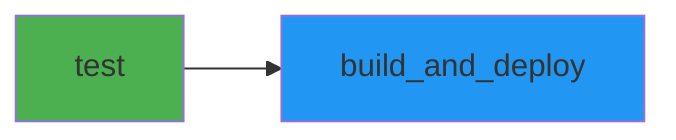

# CI/CD Workflows

This directory contains GitHub Actions workflows for automated testing, building, and deployment of the TaskAgent application.

## 📋 Workflow Overview

| Workflow | File | Target | Tests | Deployment |
|----------|------|--------|-------|------------|
| [Backend](#backend-workflow) | `backend.yml` | .NET 10 Web API | 132 (Unit + Integration) | Azure App Service |
| [Frontend](#frontend-workflow) | `frontend.yml` | Next.js 16 | 94 (Unit + E2E) | Azure Static Web Apps |

**Total Tests**: 226 tests executed on every push/PR

---

## 🔧 Backend Workflow

**File**: [`backend.yml`](backend.yml)

### Trigger Conditions

- **Push to `main`** when these paths change:
  - `.github/workflows/backend.yml`
  - `src/Directory.Build.props`
  - `src/Directory.Packages.props`
  - `src/global.json`
  - `src/backend/services/TaskAgent/src/**/*.cs`
  - `src/backend/services/TaskAgent/src/**/*.csproj`
  - `src/backend/services/TaskAgent/src/**/*.json`
  - `src/backend/services/TaskAgent/tests/**/*.cs`
  - `src/backend/services/TaskAgent/tests/**/*.csproj`
  - `src/backend/TaskAgent.ServiceDefaults/**`
  - `src/backend/TaskAgentWeb.sln`

- **Pull Request to `main`** when these paths change:
  - `src/backend/**` (except `.md` files)

### Jobs



#### 1. Test Job (Always runs)

| Step | Description | Timeout |
|------|-------------|--------|
| Checkout | Clone repository | - |
| Setup .NET | Install .NET 10.0.x SDK | - |
| Restore | Restore solution NuGet packages | - |
| Build | Build solution in Release | - |
| **Unit Tests (Domain)** | `TaskAgent.Domain.UnitTests` (28 tests) | - |
| **Unit Tests (Application)** | `TaskAgent.Application.UnitTests` (75 tests) | - |
| **Integration Tests** | `TaskAgent.Infrastructure.IntegrationTests` (29 tests) | - |
| Generate Coverage Report | Combine coverage with ReportGenerator | - |
| Generate Summary | Test counts + coverage in Job Summary | - |
| Upload Test Results | `backend-test-results` artifact (TRX) | 30 days |
| Upload Coverage | `backend-coverage` artifact (HTML) | 30 days |

**Total Tests**: 132 (103 unit + 29 integration with Testcontainers)

#### 2. Build Job (Push to main only)

| Step | Description |
|------|-------------|
| Checkout | Clone repository |
| Setup .NET | Install .NET 10.0.x SDK |
| Restore | Restore NuGet packages |
| Build | Build in Release configuration |
| Publish | Create deployment package |
| Upload Artifact | Save `webapp` artifact |

#### 3. Deploy Job (Push to main only)

| Step | Description |
|------|-------------|
| Download Artifact | Retrieve build output |
| Azure Login | Authenticate with Service Principal |
| Deploy | Push to Azure App Service |

### Test Visualization

The workflow provides rich test visualization directly in GitHub:

#### Job Summary (Workflow Summary Page)

## 🧪 Backend Test Results

### 📊 Test Summary

| Project | Tests | Status |
|---------|-------|--------|
| Domain.UnitTests | 28/28 | ✅ |
| Application.UnitTests | 75/75 | ✅ |
| Infrastructure.IntegrationTests | 29/29 | ✅ |

### 📈 Coverage Summary (Combined)

| Metric | Coverage |
|--------|----------|
| Lines | 75.5% |
| Branches | 62.3% |
| Methods | 80.1% |

📥 **Download Reports:**
- `backend-test-results` - TRX test results
- `backend-coverage` - HTML coverage report

### Environment Variables

| Variable | Value | Description |
|----------|-------|-------------|
| `AZURE_WEBAPP_NAME` | `app-taskagent-prod` | Azure App Service name |
| `DOTNET_CORE_VERSION` | `10.0.x` | .NET SDK version |
| `CONFIGURATION` | `Release` | Build configuration |
| `SOLUTION_PATH` | `src/backend/TaskAgentWeb.sln` | Solution file path |
| `TESTS_DIRECTORY` | `src/backend/services/TaskAgent/tests` | Test projects path |

### Artifacts

| Artifact | Content | Retention |
|----------|---------|----------|
| `backend-test-results` | TRX test result files | 30 days |
| `backend-coverage` | Combined HTML coverage report | 30 days |
| `webapp` | Published .NET app | Default |

### Required Secrets

| Secret | Description |
|--------|-------------|
| `app_taskagent_prod_SPN` | Azure Service Principal credentials (JSON) |

---

## ⚛️ Frontend Workflow

**File**: [`frontend.yml`](frontend.yml)

### Trigger Conditions

- **Push to `main`** when these paths change:
  - `.github/workflows/frontend.yml`
  - `src/frontend/task-agent-web/**` (except `.md` files)

- **Pull Request to `main`** when these paths change:
  - `src/frontend/task-agent-web/**` (except `.md` files)

### Jobs



#### 1. Test Job (Always runs)

| Step | Description | Timeout |
|------|-------------|---------|
| Checkout | Clone repository | - |
| Setup pnpm | Install pnpm v9 | - |
| Setup Node.js | Install Node.js 20 + cache | - |
| Install dependencies | `pnpm install --frozen-lockfile` | - |
| **Unit Tests** | `pnpm test:coverage` (57 tests) | - |
| Generate Summary | Coverage table in Job Summary | - |
| Upload Coverage | `unit-test-coverage` artifact | 30 days |
| Install Playwright | Chromium browser + dependencies | - |
| **E2E Tests** | `pnpm test:e2e` (37 tests) | - |
| Generate Summary | E2E results in Job Summary | - |
| Upload Report | `playwright-report` artifact | 30 days |
| Upload Failures | `playwright-test-results` (on failure) | 7 days |

**Total Tests**: 94 (57 unit + 37 E2E)

#### 2. Build and Deploy Job (Push to main only)

| Step | Description |
|------|-------------|
| Checkout | Clone repository with submodules |
| Setup pnpm | Install pnpm v9 |
| Setup Node.js | Install Node.js 20 + cache |
| Install dependencies | `pnpm install --frozen-lockfile` |
| Build | `pnpm build` with environment variables |
| Deploy | Push to Azure Static Web Apps |

### Test Visualization

The workflow provides rich test visualization directly in GitHub:

#### Job Summary (Workflow Summary Page)

## 🧪 Unit Test Results

### 📊 Coverage Summary

| Metric | Coverage |
|--------|----------|
| Lines | 85.2% |
| Statements | 84.1% |
| Functions | 78.5% |
| Branches | 72.3% |

## 🎭 Playwright E2E Test Results

✅ E2E tests completed. See artifacts for detailed HTML report.

📥 **Download Reports:**
- `playwright-report` - Interactive HTML report
- `unit-test-coverage` - Coverage HTML report

#### GitHub Annotations

When E2E tests fail, Playwright's `github` reporter creates **annotations directly in the code**:


### Required Secrets

| Secret | Description |
|--------|-------------|
| `AZURE_STATIC_WEB_APPS_API_TOKEN` | Azure Static Web Apps deployment token |
| `NEXT_PUBLIC_API_URL` | Backend API URL for production |

### Artifacts

| Artifact | Content | Retention |
|----------|---------|-----------|
| `unit-test-coverage` | HTML coverage report, lcov, JSON | 30 days |
| `playwright-report` | Interactive HTML E2E report | 30 days |
| `playwright-test-results` | Screenshots/videos (on failure) | 7 days |

---

## 🔐 Setting Up Secrets

### Backend Secrets

1. **Create Azure Service Principal**:
   ```bash
   az ad sp create-for-rbac \
     --name "github-actions-taskagent" \
     --role contributor \
     --scopes /subscriptions/{subscription-id}/resourceGroups/{resource-group} \
     --sdk-auth
   ```

2. **Add to GitHub Secrets**:
   - Go to Repository → Settings → Secrets → Actions
   - Add `app_taskagent_prod_SPN` with the JSON output

### Frontend Secrets

1. **Get Azure Static Web Apps Token**:
   - Azure Portal → Static Web Apps → Your App → Manage deployment token

2. **Add to GitHub Secrets**:
   - `AZURE_STATIC_WEB_APPS_API_TOKEN`: Deployment token
   - `NEXT_PUBLIC_API_URL`: Production API URL (e.g., `https://api.taskagent.com`)

---

## 🔄 Workflow Dependencies

```
┌─────────────────────────────────────────────────────────────┐
│                     Push to main                            │
└─────────────────────────────────────────────────────────────┘
                              │
          ┌───────────────────┴───────────────────┐
          ▼                                       ▼
┌─────────────────────┐               ┌─────────────────────┐
│   backend.yml       │               │   frontend.yml      │
│                     │               │                     │
│   ┌─────────┐       │               │   ┌─────────┐       │
│   │  test   │       │               │   │  test   │       │
│   │ 132 tests│       │               │   │ 94 tests│       │
│   └────┬────┘       │               │   └────┬────┘       │
│        │            │               │        │            │
│        ▼            │               │        ▼            │
│   ┌─────────┐       │               │   ┌─────────┐       │
│   │  build  │       │               │   │ build & │       │
│   └────┬────┘       │               │   │ deploy  │       │
│        │            │               │   └─────────┘       │
│        ▼            │               │                     │
│   ┌─────────┐       │               │  Azure Static Web   │
│   │ deploy  │       │               └─────────────────────┘
│   └─────────┘       │
│                     │
│   Azure App Service │
└─────────────────────┘

Total Tests: 226 (132 backend + 94 frontend)
```

---

## 📝 Common Tasks

### Running Workflows Manually

Both workflows can be triggered manually via GitHub UI:

1. Go to **Actions** tab
2. Select the workflow
3. Click **Run workflow**
4. Select branch and run

### Skipping CI

To skip CI for a commit, add `[skip ci]` to the commit message:

```bash
git commit -m "docs: update README [skip ci]"
```

### Testing Changes Without Deployment

For frontend, create a **Pull Request** instead of pushing directly to `main`. The `test` job will run, but `build_and_deploy` will be skipped.

### Viewing Test Results

1. Go to the workflow run in **Actions**
2. Click on **Summary** to see:
   - Coverage metrics table
   - E2E test status
   - Download links for artifacts
3. Download artifacts for detailed HTML reports

---

## 🛠️ Troubleshooting

### Common Issues

| Issue | Solution |
|-------|----------|
| "pnpm: command not found" | Ensure `pnpm/action-setup` runs BEFORE `setup-node` |
| Cache not working | Check `cache-dependency-path` points to correct lockfile |
| Playwright timeout | Increase `timeout-minutes` or check `webServer` config |
| Deployment fails | Verify secrets are set correctly |
| Tests pass locally but fail in CI | Check for environment differences (Node version, OS) |

### Debugging Failed Workflows

1. **Check Job Summary** for quick overview
2. **Download artifacts** for detailed reports
3. **Expand failed step** in workflow logs
4. **Check annotations** on Files Changed tab (for PRs)

---

## 📚 Related Documentation

- [Frontend Testing Strategy](../../src/frontend/task-agent-web/TESTING_STRATEGY.md) - Unit & E2E test details
- [Backend README](../../src/backend/services/TaskAgent/README.md) - API documentation
- [Frontend README](../../src/frontend/task-agent-web/README.md) - Frontend setup
