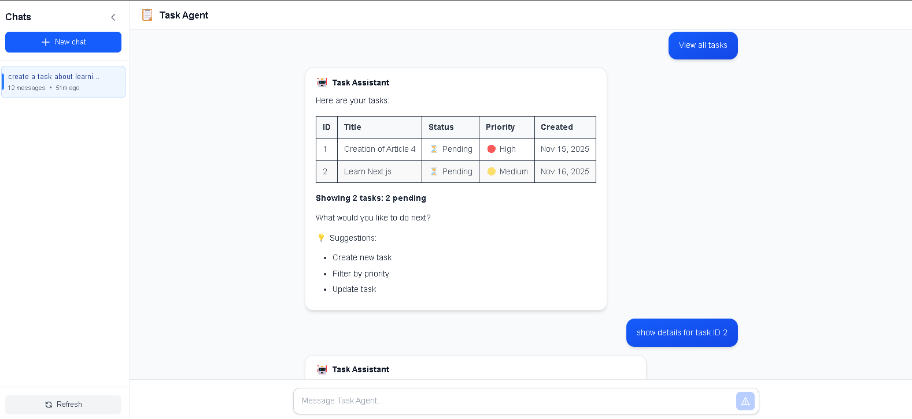
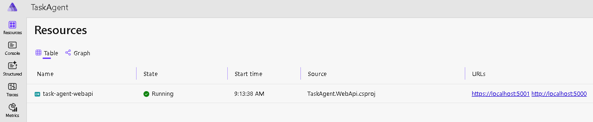
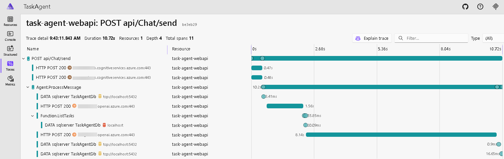
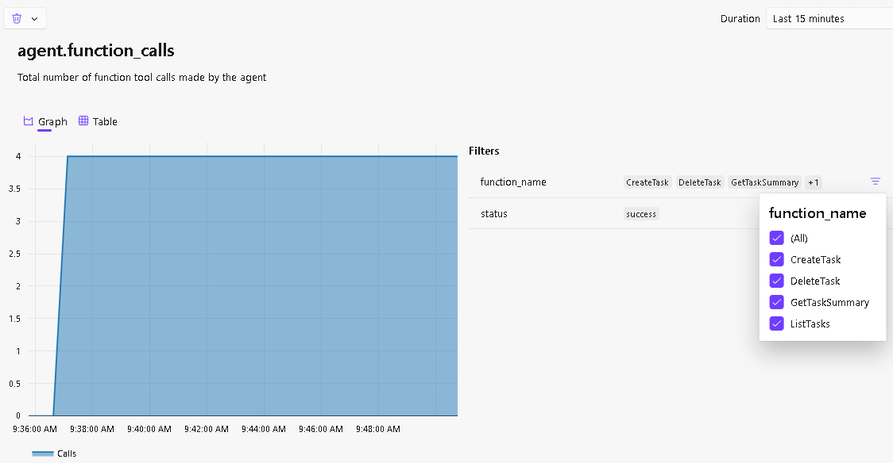
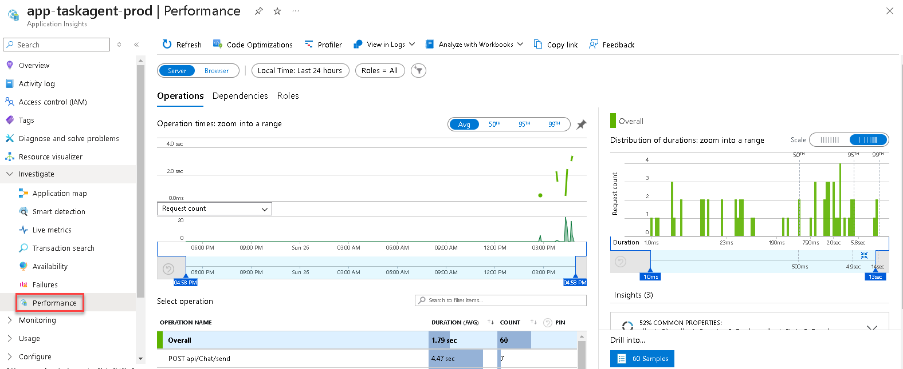
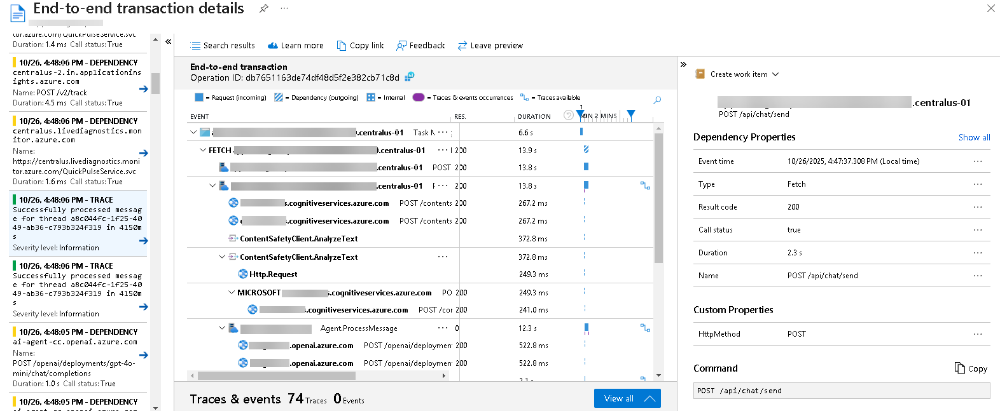

# Task Agent - AI-Powered Task Management

An intelligent task management assistant built with **Microsoft Agent Framework**, **Azure OpenAI**, and **.NET Aspire**, demonstrating Clean Architecture, autonomous AI agents, and production-grade observability with Azure Content Safety protection.



---

## 🎥 Demo Video

[](https://youtu.be/YVrNPfa_kaU)

Watch the full demonstration of the Task Agent in action, showcasing:

- Natural language task management
- AI-powered suggestions and insights
- Content Safety protection
- Real-time chat management
- Modern Next.js frontend with ChatGPT-inspired UI

---

## 📚 Article Series

This project is documented in a comprehensive article series on C# Corner:

1. [**Building a Task Management AI Agent**](https://www.c-sharpcorner.com/article/building-an-ai-task-management-agent-using-microsoft-agentic-ai-framework/) - Microsoft Agent Framework, Azure OpenAI integration, and Clean Architecture
2. [**Securing AI Agents**](https://www.c-sharpcorner.com/article/securing-your-ai-task-agent-with-azure-ai-content-safety/) - Azure AI Content Safety with Prompt Shield and parallel validation
3. [**Production-Grade Observability**](https://www.c-sharpcorner.com/article/real-time-observability-for-ai-agents-with-net-aspire-application-insights-o/) - .NET Aspire, OpenTelemetry, and Application Insights
4. [**Modern Frontend Architecture**](https://www.c-sharpcorner.com/article/building-a-modern-task-management-ai-agent-separating-backend-and-frontend-with/) - Next.js 16 separation, dual-database strategy, and Azure Static Web Apps

**Topics Covered**:

- 🤖 Autonomous AI agents with function calling
- 🛑 Multi-layer security (Prompt Shield + Content Moderation)
- 📈 Production observability (Aspire Dashboard + Application Insights)
- ⚛️ Modern React with Next.js 16 and TypeScript
- 🗄️ Dual-database architecture (SQL Server + PostgreSQL)
- ☁️ Azure deployment with Static Web Apps

---

## 🚀 Quick Start

```bash
# 1. Configure your Azure credentials in src/backend/services/TaskAgent/src/TaskAgent.WebApi/appsettings.Development.json

# 2. Setup PostgreSQL database (see docs/POSTGRESQL_MIGRATION.md for details)

# 3. Run with .NET Aspire (includes Aspire Dashboard)
dotnet run --project src/TaskAgent.AppHost

# Or run backend standalone
cd src/backend/services/TaskAgent/src
dotnet run --project TaskAgent.WebApi

# 4. Run frontend (separate terminal)
cd src/frontend/task-agent-web
pnpm install
pnpm dev
```

**Access**:

- Frontend: http://localhost:3000
- Backend API: https://localhost:5001
- Aspire Dashboard: https://localhost:17198 (when using Aspire)

---

## ✨ Features

**Backend Features**:

- 💬 **Natural Language Interface**: Talk to your task manager like a person
- 🛡️ **Multi-Layer Security**: Azure Content Safety protection (Prompt Shield + Content Moderation)
- 📊 **Production-Grade Observability**: Full OpenTelemetry stack with .NET Aspire
- 📝 **Centralized Logging**: Serilog with console, file, and OpenTelemetry sinks
- 🎯 **AG-UI Protocol**: Custom streaming endpoint `/api/agent/chat` with SSE and state persistence
- ✅ **Complete CRUD**: Create, read, update, and delete tasks
- 📈 **Smart Analytics**: Task summaries with filtering by status and priority
- 🎨 **Beautiful Tables**: Markdown-formatted responses with emojis
- 💡 **Contextual Suggestions**: Agent provides helpful next actions
- 🗄️ **PostgreSQL Persistence**: Entity Framework Core with JSON storage (preserves property order)
- 💬 **Chat Management**: Persistent threads with automatic message persistence
- 🔍 **Distributed Tracing**: End-to-end request tracking with custom activity sources
- 📉 **Custom Metrics**: Real-time monitoring of AI agent operations

**Frontend Features**:

- ⚛️ **Modern React**: Next.js 16 + React 19 with TypeScript
- 🎯 **Server Components**: Optimized bundle size and performance
- 🎨 **ChatGPT-Inspired UI**: Full-height adaptive layout with Tailwind CSS 4
- 🌓 **Dark Theme Support**: System detection + manual toggle with next-themes
- 📐 **Smart Layout**: Centered welcome state, fixed input when chatting
- 🔄 **Independent Scrolling**: Fixed header and input, scrollable messages
- 💡 **Clickable Suggestions**: Interactive suggestion buttons from AI
- ⏳ **Contextual Loading**: Rotating status messages during processing
- ⚡ **Optimistic Updates**: Instant message feedback
- 📝 **Markdown Rendering**: Rich text formatting in chat
- 🎭 **Type Safety**: Full TypeScript with backend contract alignment
- 🧩 **Clean Architecture**: Separation of concerns (UI → Hooks → API)
- 📂 **Chat Management**: List, load, and delete chats with auto-generated titles
- 🗂️ **Sidebar Navigation**: Collapsible sidebar with chat history

---

## 📊 Observability & Monitoring

This project implements **production-grade observability** using .NET Aspire and OpenTelemetry with a **hybrid architecture**:

### Development Environment (Local)



**Stack**: OpenTelemetry → OTLP Exporter → **Aspire Dashboard** (https://localhost:17198)

**Features**:

- 📊 Real-time metrics visualization
- 🔍 Distributed tracing with automatic trace correlation
- 📝 Structured logging with log levels and scopes (via Serilog + OpenTelemetry)
- 🔗 Dependency mapping (Azure OpenAI, Content Safety, PostgreSQL)
- 🎯 Custom instrumentation for AI agent operations

### Production Environment (Azure)

**Stack**: OpenTelemetry → Azure Monitor Exporter → **Application Insights**

**Features**:

- 📈 Performance monitoring and alerting
- 🗺️ Application Map with dependencies
- 🔥 Live metrics and real-time telemetry
- 📊 Custom dashboards and workbooks
- 🔔 Smart detection and anomaly alerts

### Three Pillars of Observability

**Centralized Configuration** via `ServiceDefaults`:
- **Logging** (Serilog) - Console + File sinks + OpenTelemetry integration
- **Tracing** (OpenTelemetry Activity) - Custom activity sources for AI agent
- **Metrics** (OpenTelemetry Meter) - Custom meters for AI operations

#### 1️⃣ Metrics (Custom + Built-in)

**Custom AI Agent Metrics**:

```csharp
Meter: "TaskAgent.Agent"

Counters:
- agent.requests         → Total requests to the agent
- agent.function_calls   → Function tool invocations
- agent.errors          → Error count by type

Histograms:
- agent.response.duration → Response time in milliseconds
```

**Built-in Metrics** (automatic):

- ASP.NET Core instrumentation (HTTP requests, response times)
- HTTP Client instrumentation (Azure OpenAI, Content Safety calls)
- Runtime instrumentation (GC, thread pool, exceptions)

#### 2️⃣ Distributed Tracing

**Custom Activity Sources**:

```csharp
ActivitySource: "TaskAgent.Agent"

Spans:
- Agent.ProcessMessage    → End-to-end message processing
- Function.{FunctionName} → Individual function tool calls

Tags:
- thread.id              → Chat thread identifier
- function.name          → Called function name
- message.length         → User message size
- response.length        → Agent response size
```

**Built-in Traces** (automatic):

- ASP.NET Core HTTP requests
- Entity Framework Core SQL queries (development only)
- HTTP client calls to Azure services

#### 3️⃣ Structured Logging

**Configuration**:

- Formatted messages included
- Log scopes enabled
- Integration with OpenTelemetry
- Automatic correlation with traces

**Log Levels**:

- Information: Agent operations, function calls
- Warning: Content safety blocks, validation failures
- Error: Exceptions, service failures

### Hybrid Telemetry Architecture

**Smart Environment Detection**:

```csharp
// Automatically selects exporter based on configuration
if (OTEL_EXPORTER_OTLP_ENDPOINT exists)
    → Use OTLP → Aspire Dashboard

if (APPLICATIONINSIGHTS_CONNECTION_STRING exists)
    → Use Azure Monitor → Application Insights
```

**Security**: SQL statement capture is **disabled in production** to prevent sensitive data leakage.

**Service Discovery**: HTTPS-only in production, HTTP + HTTPS in development.

---

## 🛡️ Content Safety

This application leverages **Azure OpenAI's built-in content filtering system** for content safety.

### Built-in Content Filtering

Azure OpenAI automatically filters content in the following categories:

- **Hate speech** → Medium threshold (blocks moderate+ severity)
- **Violence** → Medium threshold (blocks moderate+ severity)
- **Sexual content** → Medium threshold (blocks moderate+ severity)
- **Self-harm** → Medium threshold (blocks moderate+ severity)
- **Prompt injection attacks** (Jailbreak detection)

### Error Handling

When content filter triggers:

1. Azure OpenAI returns HTTP 400 with `code: "content_filter"`
2. Backend catches `ClientResultException` in `AgentStreamingService`
3. Sends `CONTENT_FILTER` SSE event to frontend
4. Frontend displays ChatGPT-like friendly message in chat (not toast)

### Security Enhancements

**Blocked Message Handling**:

- ✅ Blocked messages appear as assistant responses in chat (not error toasts)
- ✅ Thread placeholders created for chat continuity (ChatGPT-like UX)
- ✅ **Blocked content is NEVER persisted in database** (security measure)
- ✅ Automatic sidebar updates when threads are created
- ✅ Smart title regeneration when first valid message is sent after a block
- ✅ Optimized sidebar refresh: only reloads when title changes from null (efficient!)

**Best Practices**:

- Generic conversational refusals (like ChatGPT) - no technical details exposed
- Security violations render as normal bot messages
- No error styling for content safety blocks

**For detailed testing guide**: See [docs/CONTENT_SAFETY.md](docs/CONTENT_SAFETY.md)

---

## 🏗️ Architecture

**Built with Clean Architecture for maintainability and testability:**

```
┌─────────────────────────────────────────────────┐
│                 Frontend (Next.js)              │
│  • React 19 + TypeScript                        │
│  • Server Components + Client Components        │
│  • Chat Management UI                           │
└────────────────────┬────────────────────────────┘
                     │ REST API
                     ▼
┌─────────────────────────────────────────────────┐
│              Backend (.NET 10)                  │
│                                                 │
│  Presentation → Infrastructure → Application    │
│                                  → Domain       │
│                                                 │
│  • AI Agent with 6 function tools               │
│  • Content Safety middleware                    │
│  • Dual-database persistence                    │
└─────────────────────────────────────────────────┘
                     │
                     ▼
┌─────────────────────────────────────────────────┐
│             Databases & Services                │
│  • SQL Server: Task entities                    │
│  • PostgreSQL: Chat threads (JSON)              │
│  • Azure OpenAI: GPT-4o-mini                    │
│  • Azure AI Content Safety                      │
│  • Application Insights                         │
└─────────────────────────────────────────────────┘
```

**For detailed architecture documentation:**

- 📘 [Backend README](src/backend/services/TaskAgent/README.md) - Clean Architecture layers, API endpoints, observability
- 📗 [Frontend README](src/frontend/task-agent-web/README.md) - Component structure, state management, API integration
- 📙 [Architecture Decisions](docs/DUAL_DATABASE_ARCHITECTURE.md) - Dual-database rationale and patterns

---

## 🛠️ Tech Stack

### Backend

| Technology                 | Purpose                    |
| -------------------------- | -------------------------- |
| .NET 10                    | Modern web framework       |
| ASP.NET Core Web API       | RESTful API                |
| .NET Aspire 13.0.0         | Cloud-native orchestration |
| OpenTelemetry              | Observability framework    |
| Entity Framework Core 10   | Database ORM               |
| SQL Server                 | Task data persistence      |
| PostgreSQL 15+             | Chat persistence           |
| Microsoft Agent Framework  | Autonomous AI agents (preview) |
| Azure OpenAI (GPT-4o-mini) | Language model             |
| Azure AI Content Safety    | Security & moderation      |

### Frontend

| Technology     | Purpose                 |
| -------------- | ----------------------- |
| Next.js 16     | React framework         |
| React 19       | UI library              |
| TypeScript 5   | Type-safe JavaScript    |
| Tailwind CSS 4 | Utility-first CSS       |
| pnpm           | Fast package manager    |
| react-markdown | Markdown rendering      |
| SWR (planned)  | Data fetching & caching |

---

## ⚙️ Setup

### Prerequisites

- .NET 10 SDK
- Node.js 20+ (for Next.js frontend)
- pnpm package manager (`npm install -g pnpm`)
- PostgreSQL 15+ (see [PostgreSQL Setup Guide](docs/POSTGRESQL_MIGRATION.md))
- Azure OpenAI resource with deployed model (GPT-4o-mini recommended)
- Azure AI Content Safety resource
- Azure Application Insights resource (for production)

### Configuration

#### Development Environment

**1. Update `appsettings.Development.json`**:

```json
{
  "AzureOpenAI": {
    "Endpoint": "https://your-openai-resource.openai.azure.com/",
    "ApiKey": "your-openai-api-key",
    "ModelDeployment": "gpt-4o-mini"
  }
}
```

**Note**: Content safety is handled by Azure OpenAI's built-in content filtering. No separate configuration required.

**2. Database Setup**:

```bash
# Install PostgreSQL 15+ (see docs/POSTGRESQL_MIGRATION.md for detailed instructions)

# Create database
psql -U postgres
CREATE DATABASE "TaskAgentDb";
\q

# Update connection strings in appsettings.Development.json
{
  "ConnectionStrings": {
    "TasksConnection": "Server=localhost;Database=TaskAgentDb;Trusted_Connection=true;",
    "ConversationsConnection": "Host=localhost;Port=5432;Database=taskagent_conversations;Username=postgres;Password=your_password"
  }
}

# Migrations apply automatically on startup
# Or run manually from src/backend/services/TaskAgent/src:
dotnet ef database update --context TaskDbContext --project TaskAgent.Infrastructure --startup-project TaskAgent.WebApi
dotnet ef database update --context ConversationDbContext --project TaskAgent.Infrastructure --startup-project TaskAgent.WebApi
```

**3. Configure Frontend** - Create `.env.local`:

```bash
# src/frontend/task-agent-web/.env.local
NEXT_PUBLIC_API_URL=https://localhost:5001
```

**4. Install Frontend Dependencies**:

```bash
cd src/frontend/task-agent-web
pnpm install
```

**5. Run with Aspire** (recommended - runs both backend and prepares for frontend):

```bash
# From repository root
dotnet run --project src/TaskAgent.AppHost
```

- Backend API: https://localhost:5001
- Aspire Dashboard: https://localhost:17198

**6. Run Frontend** (in a separate terminal):

```bash
cd src/frontend/task-agent-web
pnpm dev
```

- Frontend: http://localhost:3000

#### Production Environment (Azure)

**1. Update `appsettings.Production.json`**:

```json
{
  "AzureOpenAI": {
    "Endpoint": "https://your-openai-resource.openai.azure.com/",
    "ApiKey": "your-openai-api-key",
    "ModelDeployment": "gpt-4o-mini"
  },
  "APPLICATIONINSIGHTS_CONNECTION_STRING": "InstrumentationKey=your-key;IngestionEndpoint=https://...",
  "ConnectionStrings": {
    "TasksConnection": "Server=tcp:your-server.database.windows.net,1433;Initial Catalog=TaskAgentDb;User ID=your_user;Password=your_password;Encrypt=True;",
    "ConversationsConnection": "Host=your-postgres-server.postgres.database.azure.com;Port=5432;Database=TaskAgentDb;Username=your_user;Password=your_password;SslMode=Require;"
  }
}
```

**Note**: Content safety is handled by Azure OpenAI's built-in content filtering. No separate Content Safety resource required.

**2. Deploy to Azure App Service** using standard deployment methods.

---

## 🤖 AI Agent Capabilities

The Task Agent provides 6 function tools:

| Function         | Description                                        |
| ---------------- | -------------------------------------------------- |
| `CreateTask`     | Create new tasks with title, description, priority |
| `ListTasks`      | Show all tasks with optional filters               |
| `GetTaskDetails` | Get detailed info about a specific task            |
| `UpdateTask`     | Modify task status or priority                     |
| `DeleteTask`     | Remove tasks                                       |
| `GetTaskSummary` | View statistics and analytics                      |

**Example Interactions**:

```
You: Create a high priority task to review the quarterly report
Agent: ✅ Task created! ID: 1, Priority: High

You: Show me all my tasks
Agent: [Displays beautiful Markdown table with all tasks]
      💡 Suggestions: • Filter by priority • Update oldest task

You: Mark task 1 as Completed
Agent: ✅ Task updated! Status changed to Completed
```

---

## 🎨 Agent Features

### Markdown Tables

Lists 2+ tasks in beautiful formatted tables with emojis:

- Status: ⏳ Pending, 🔄 InProgress, ✅ Completed
- Priority: 🟢 Low, 🟡 Medium, 🔴 High

### Contextual Suggestions

Agent provides 1-2 smart suggestions after each operation:

- After creating: "View all tasks" or "Create follow-up"
- After listing: "Filter by priority" or "Update oldest task"
- After completing: "View remaining tasks" or "Get summary"

### Smart Insights

- Detects many pending tasks → suggests prioritizing
- Celebrates milestones → "🎉 Great! You've completed 5 tasks!"
- Encourages progress

---

## 📂 Project Structure

```
TaskAgentWeb/
├── src/                                           # Source code root
│   │
│   ├── .editorconfig                              # C# code style rules (shared)
│   ├── Directory.Build.props                      # ⭐ MSBuild properties (MUST be at src/ level)
│   ├── Directory.Packages.props                   # ⭐ Central Package Management (MUST be at src/ level)
│   ├── global.json                                # ⭐ .NET SDK + Aspire SDK versions (MUST be at src/ level)
│   │
│   ├── TaskAgent.AppHost/                         # .NET Aspire orchestration (root level)
│   │   ├── AppHost.cs                             # Orchestrates backend (+ future frontend)
│   │   ├── appsettings.json                       # Aspire settings
│   │   └── Properties/launchSettings.json         # Aspire Dashboard launch config
│   │
│   ├── backend/                                   # Backend services (.NET 10 Web API)
│   │   └── ...                                    # See src/backend/services/TaskAgent/README.md
│   │
│   └── frontend/                                  # Frontend applications (Next.js 16)
│       └── ...                                    # See src/frontend/task-agent-web/README.md
│
├── docs/                                          # Documentation
│   ├── screenshots/                               # Application screenshots
│   ├── CONTENT_SAFETY.md                          # Content Safety testing guide (75+ cases)
│   ├── DUAL_DATABASE_ARCHITECTURE.md              # PostgreSQL + SQL Server patterns
│   ├── POSTGRESQL_MIGRATION.md                    # PostgreSQL setup guide
│   └── FRONTEND_E2E_TESTING.md                    # Frontend testing guide
│
├── scripts/                                       # PowerShell scripts
│   ├── Analyze-Commits.ps1                        # Commit analysis tool
│   ├── config.json                                # Script configuration
│   └── README.md                                  # Scripts documentation
│
├── .github/                                       # GitHub workflows & Copilot instructions
│   └── copilot-instructions.md                    # Project-specific AI guidelines
│
├── LICENSE                                        # MIT License
└── README.md                                      # This file
```

**For detailed structure:**

- 📘 **Backend**: See [src/backend/services/TaskAgent/README.md](src/backend/services/TaskAgent/README.md) for Clean Architecture layers (Domain, Application, Infrastructure, WebApp)
- 📗 **Frontend**: See [src/frontend/task-agent-web/README.md](src/frontend/task-agent-web/README.md) for Next.js components, hooks, and API integration

### Key Architectural Decisions

**MSBuild Configuration at Root**: `Directory.Build.props`, `Directory.Packages.props`, and `global.json` live at `src/` level (not in `backend/`). MSBuild searches upward from each project directory - this ensures both `TaskAgent.AppHost` (at `src/`) and backend projects (at `src/backend/services/`) can access them. **No duplicates needed**.

**Clean Architecture**: Domain → Application → Infrastructure → WebApp (strict dependency flow, Domain has NO external dependencies)

**Aspire Orchestration at Root**: `TaskAgent.AppHost` lives outside `backend/` because it orchestrates both backend and future frontend services

**Backend-Only Telemetry**: `TaskAgent.ServiceDefaults` is .NET-specific OpenTelemetry, lives in `backend/`, NOT used by frontend

**Observability-First**: OpenTelemetry instrumentation at every layer via ServiceDefaults

**Hybrid Telemetry**:

- Development: OTLP → Aspire Dashboard
- Production: Azure Monitor → Application Insights

**Security**: Content Safety middleware + HTTPS-only service discovery in production

---

## 🔒 Security

### Content Safety

- **2-Layer Defense**: Automatic Prompt Shield + Content Moderation
- **Fail-Secure**: Blocks requests on Prompt Shield errors; Fail-Open on Content Moderation for availability
- **Optimized Detection**: Prompt Shield uses pre-trained model (no system context) to reduce false positives
- **Performance**: HttpClientFactory with Named HttpClient for connection pooling and DNS refresh
- **Immutable DTOs**: Record types for thread-safety and proper equality semantics
- **Best Practices**: ChatGPT-style generic refusals without exposing attack details
- **See**: [docs/CONTENT_SAFETY.md](docs/CONTENT_SAFETY.md) for 75+ test cases and troubleshooting

### Application Security

- **Input Validation**: EF Core parameterized queries prevent SQL injection
- **XSS Protection**: DOMPurify sanitization on client-side
- **Configuration Validation**: Startup checks for missing credentials
- **HTTPS Enforcement**: Service discovery restricted to HTTPS in production
- **Secret Management**: Never commit API keys - use Azure Key Vault in production
- **SQL Security**: Database statement capture disabled in production

---

## 📸 Screenshots

### .NET Aspire Dashboard (Development)


_Real-time observability with traces, metrics, and logs_


_End-to-end request tracing with custom activity sources_


_AI agent performance metrics (requests, function calls, response time)_

### Azure Application Insights (Production)


_Response time and dependency tracking_


_Production distributed tracing_

---

## 📚 Documentation

- **[Content Safety Guide](docs/CONTENT_SAFETY.md)** - Security testing with 75+ test cases
- **[Documentation Index](docs/README.md)** - Full documentation structure

---

## 📖 License

This project is licensed under the **MIT License** - see the [LICENSE](LICENSE) file for details.

### What this means:

- ✅ Free to use for personal and commercial projects
- ✅ Free to modify and distribute
- ✅ Free to use in your own educational content
- ℹ️ Just keep the copyright notice

---

**Built with ❤️ using .NET 10, Next.js 16, React 19, Microsoft Agent Framework, .NET Aspire, and Clean Architecture**
