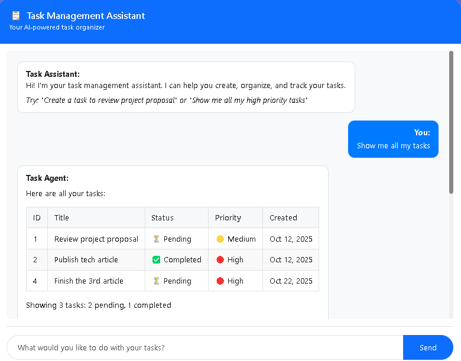
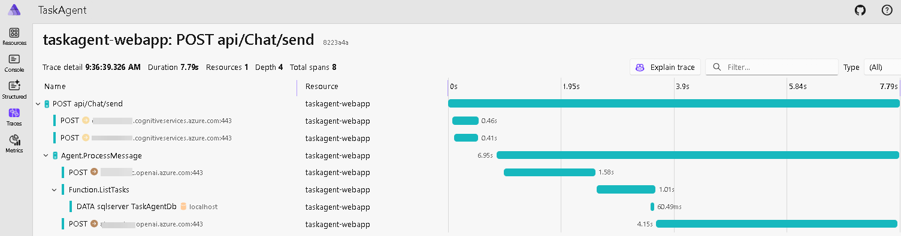

# Task Agent - AI-Powered Task Management

An intelligent task management assistant built with **Microsoft Agent Framework**, **Azure OpenAI**, and **.NET Aspire**, demonstrating Clean Architecture, autonomous AI agents, and production-grade observability with Azure Content Safety protection.



---

## 🚀 Quick Start

```bash
# Navigate to the project
cd src

# Restore dependencies
dotnet restore

# Configure your Azure credentials in appsettings.Development.json
# Run with .NET Aspire (includes Aspire Dashboard)
dotnet run --project src/TaskAgent.AppHost

# Or run standalone
dotnet run --project src/services/TaskAgent/src/TaskAgent.WebApp
```

**Development**: Visit `http://localhost:5000` for the app and `https://localhost:17198` for Aspire Dashboard  
**Production**: Observability data flows to Azure Application Insights automatically

---

## ✨ Features

- 💬 **Natural Language Interface**: Talk to your task manager like a person
- 🛡️ **Multi-Layer Security**: Azure Content Safety protection (Prompt Shield + Content Moderation)
- 📊 **Production-Grade Observability**: Full OpenTelemetry stack with .NET Aspire
- ✅ **Complete CRUD**: Create, read, update, and delete tasks
- � **Smart Analytics**: Task summaries with filtering by status and priority
- 🎨 **Beautiful Tables**: Markdown-formatted responses with emojis
- 💡 **Contextual Suggestions**: Agent provides helpful next actions
- 🗄️ **SQL Server Persistence**: Entity Framework Core with LocalDB
- 🔍 **Distributed Tracing**: End-to-end request tracking with custom activity sources
- 📉 **Custom Metrics**: Real-time monitoring of AI agent operations

---

## 📊 Observability & Monitoring

This project implements **production-grade observability** using .NET Aspire and OpenTelemetry with a **hybrid architecture**:

### Development Environment (Local)


**Stack**: OpenTelemetry → OTLP Exporter → **Aspire Dashboard** (https://localhost:17198)

**Features**:

- 📊 Real-time metrics visualization
- 🔍 Distributed tracing with automatic trace correlation
- 📝 Structured logging with log levels and scopes
- 🔗 Dependency mapping (Azure OpenAI, Content Safety, SQL Server)
- 🎯 Custom instrumentation for AI agent operations

### Production Environment (Azure)

**Stack**: OpenTelemetry → Azure Monitor Exporter → **Application Insights**

**Features**:

- 📈 Performance monitoring and alerting
- 🗺️ Application Map with dependencies
- 🔥 Live metrics and real-time telemetry
- 📊 Custom dashboards and workbooks
- 🔔 Smart detection and anomaly alerts

### Three Pillars of Observability

#### 1️⃣ Metrics (Custom + Built-in)

**Custom AI Agent Metrics**:

```csharp
Meter: "TaskAgent.Agent"

Counters:
- agent.requests         → Total requests to the agent
- agent.function_calls   → Function tool invocations
- agent.errors          → Error count by type

Histograms:
- agent.response.duration → Response time in milliseconds
```

**Built-in Metrics** (automatic):

- ASP.NET Core instrumentation (HTTP requests, response times)
- HTTP Client instrumentation (Azure OpenAI, Content Safety calls)
- Runtime instrumentation (GC, thread pool, exceptions)

#### 2️⃣ Distributed Tracing

**Custom Activity Sources**:

```csharp
ActivitySource: "TaskAgent.Agent"

Spans:
- Agent.ProcessMessage    → End-to-end message processing
- Function.{FunctionName} → Individual function tool calls

Tags:
- thread.id              → Conversation thread identifier
- function.name          → Called function name
- message.length         → User message size
- response.length        → Agent response size
```

**Built-in Traces** (automatic):

- ASP.NET Core HTTP requests
- Entity Framework Core SQL queries (development only)
- HTTP client calls to Azure services

#### 3️⃣ Structured Logging

**Configuration**:

- Formatted messages included
- Log scopes enabled
- Integration with OpenTelemetry
- Automatic correlation with traces

**Log Levels**:

- Information: Agent operations, function calls
- Warning: Content safety blocks, validation failures
- Error: Exceptions, service failures

### Hybrid Telemetry Architecture

**Smart Environment Detection**:

```csharp
// Automatically selects exporter based on configuration
if (OTEL_EXPORTER_OTLP_ENDPOINT exists)
    → Use OTLP → Aspire Dashboard

if (APPLICATIONINSIGHTS_CONNECTION_STRING exists)
    → Use Azure Monitor → Application Insights
```

**Security**: SQL statement capture is **disabled in production** to prevent sensitive data leakage.

**Service Discovery**: HTTPS-only in production, HTTP + HTTPS in development.

---

## 🛡️ Content Safety

This application implements **2-layer defense** using Azure AI Content Safety with **parallel execution**:

### Layer 1: Prompt Shield

- Detects prompt injection attacks (jailbreaks, instruction override, role manipulation)
- REST API: `/contentsafety/text:shieldPrompt` (API version 2024-09-01)
- Blocks malicious attempts to manipulate the AI system
- **Optimized**: Trusts Azure's pre-trained model without system context (reduces false positives)

### Layer 2: Content Moderation

- Analyzes text for harmful content (Hate, Violence, Sexual, Self-Harm)
- SDK: Azure AI Content Safety
- Configurable severity thresholds (0-6 scale)

**Architecture**: Content safety checks run automatically via middleware before any AI processing.

**Performance**:

- **Parallel Execution**: Both layers validate simultaneously using `Task.WhenAll` (~50% faster)
- **IHttpClientFactory**: Named HttpClient for optimal connection pooling and DNS refresh
- **Response Time**: ~200-400ms for safe prompts (vs ~400-800ms sequential)

**Best Practices**:

- Generic conversational refusals (like ChatGPT) - no technical details exposed
- Security violations render as normal bot messages
- No error styling for content safety blocks

**Testing**: See [docs/CONTENT_SAFETY.md](docs/CONTENT_SAFETY.md) for 75+ test cases, known limitations, and troubleshooting guide.

---

## 🏗️ Architecture

Built with **Clean Architecture** for maintainability and testability:

```
TaskAgent.Domain (Entities, Business Logic)
    ↓
TaskAgent.Application (Use Cases, Interfaces)
    ↓
TaskAgent.Infrastructure (Data Access, Azure Services)
    ↓
TaskAgent.WebApp (UI, Controllers, AI Agent)
```

**Key Components**:

- **Domain**: `TaskItem` entity with business rules, Status/Priority enums
- **Application**: DTOs (using record types), `ITaskRepository`, `IThreadPersistenceService`, 6 AI function tools
- **Infrastructure**: `TaskDbContext`, `TaskRepository`, `ContentSafetyService` with HttpClientFactory, `InMemoryThreadPersistenceService`
- **Presentation**: MVC controllers, Razor views, `TaskAgentService`, configuration validation extensions

**Conversation Persistence**:

- Thread state serialized/deserialized across requests using `AgentThread.Serialize()`
- `IThreadPersistenceService` abstraction for storage flexibility
- In-memory implementation for single-server deployments
- Production: Use Redis/SQL for multi-server scenarios

---

## 🛠️ Tech Stack

| Technology                 | Purpose                    |
| -------------------------- | -------------------------- |
| .NET 9.0                   | Modern web framework       |
| ASP.NET Core MVC           | Web application            |
| .NET Aspire                | Cloud-native orchestration |
| OpenTelemetry              | Observability framework    |
| Entity Framework Core      | Database ORM               |
| SQL Server LocalDB         | Data persistence           |
| Microsoft Agent Framework  | Autonomous AI agents       |
| Azure OpenAI (GPT-4o-mini) | Language model             |
| Azure AI Content Safety    | Security & moderation      |
| Bootstrap 5                | Responsive UI              |
| Marked.js                  | Markdown rendering         |

---

## ⚙️ Setup

### Prerequisites

- .NET 9.0 SDK
- SQL Server LocalDB (included with Visual Studio)
- Azure OpenAI resource with deployed model (GPT-4o-mini recommended)
- Azure AI Content Safety resource
- Azure Application Insights resource (for production)

### Configuration

#### Development Environment

**1. Update `appsettings.Development.json`**:

```json
{
  "AzureOpenAI": {
    "Endpoint": "https://your-openai-resource.openai.azure.com/",
    "ApiKey": "your-openai-api-key",
    "ModelDeployment": "gpt-4o-mini"
  },
  "ContentSafety": {
    "Endpoint": "https://your-contentsafety-resource.cognitiveservices.azure.com/",
    "ApiKey": "your-contentsafety-api-key",
    "HateThreshold": 2,
    "ViolenceThreshold": 2,
    "SexualThreshold": 2,
    "SelfHarmThreshold": 2
  }
}
```

**2. Database** (auto-created on first run, or manually):

```bash
cd src/services/TaskAgent/src
dotnet ef database update --project TaskAgent.Infrastructure --startup-project TaskAgent.WebApp
```

**3. Run with Aspire** (recommended):

```bash
dotnet run --project src/TaskAgent.AppHost
```

- Application: https://localhost:5001
- Aspire Dashboard: https://localhost:17198

#### Production Environment (Azure)

**1. Update `appsettings.Production.json`**:

```json
{
  "AzureOpenAI": {
    "Endpoint": "https://your-openai-resource.openai.azure.com/",
    "ApiKey": "your-openai-api-key",
    "ModelDeployment": "gpt-4o-mini"
  },
  "ContentSafety": {
    "Endpoint": "https://your-contentsafety-resource.cognitiveservices.azure.com/",
    "ApiKey": "your-contentsafety-api-key",
    "HateThreshold": 2,
    "ViolenceThreshold": 2,
    "SexualThreshold": 2,
    "SelfHarmThreshold": 2
  },
  "APPLICATIONINSIGHTS_CONNECTION_STRING": "InstrumentationKey=your-key;IngestionEndpoint=https://...",
  "ConnectionStrings": {
    "DefaultConnection": "Server=tcp:your-server.database.windows.net,1433;Initial Catalog=TaskAgentDb;..."
  }
}
```

**2. Deploy to Azure App Service** using standard deployment methods.

---

## 🤖 AI Agent Capabilities

The Task Agent provides 6 function tools:

| Function         | Description                                        |
| ---------------- | -------------------------------------------------- |
| `CreateTask`     | Create new tasks with title, description, priority |
| `ListTasks`      | Show all tasks with optional filters               |
| `GetTaskDetails` | Get detailed info about a specific task            |
| `UpdateTask`     | Modify task status or priority                     |
| `DeleteTask`     | Remove tasks                                       |
| `GetTaskSummary` | View statistics and analytics                      |

**Example Interactions**:

```
You: Create a high priority task to review the quarterly report
Agent: ✅ Task created! ID: 1, Priority: High

You: Show me all my tasks
Agent: [Displays beautiful Markdown table with all tasks]
      💡 Suggestions: • Filter by priority • Update oldest task

You: Mark task 1 as Completed
Agent: ✅ Task updated! Status changed to Completed
```

---

## 🎨 Agent Features

### Markdown Tables

Lists 2+ tasks in beautiful formatted tables with emojis:

- Status: ⏳ Pending, 🔄 InProgress, ✅ Completed
- Priority: 🟢 Low, 🟡 Medium, 🔴 High

### Contextual Suggestions

Agent provides 1-2 smart suggestions after each operation:

- After creating: "View all tasks" or "Create follow-up"
- After listing: "Filter by priority" or "Update oldest task"
- After completing: "View remaining tasks" or "Get summary"

### Smart Insights

- Detects many pending tasks → suggests prioritizing
- Celebrates milestones → "🎉 Great! You've completed 5 tasks!"
- Encourages progress

---

## 📂 Project Structure

```
TaskAgentWeb/
├── src/
│   ├── TaskAgent.AppHost/                         # .NET Aspire orchestration
│   │   ├── AppHost.cs                            # Aspire app host configuration
│   │   └── appsettings.json                      # Aspire settings
│   │
│   ├── TaskAgent.ServiceDefaults/                 # Shared observability configuration
│   │   └── ServiceDefaultsExtensions.cs          # OpenTelemetry setup
│   │
│   └── services/TaskAgent/src/
│       ├── TaskAgent.Domain/                      # Core business logic (NO dependencies)
│       │   ├── Entities/                         # TaskItem with business rules
│       │   ├── Enums/                            # TaskStatus, TaskPriority
│       │   └── Constants/                        # Domain constants
│       │
│       ├── TaskAgent.Application/                 # Use cases & interfaces
│       │   ├── DTOs/                             # Record types for immutability
│       │   ├── Functions/                        # 6 AI function tools
│       │   ├── Interfaces/                       # ITaskRepository, IContentSafetyService
│       │   └── Telemetry/                        # Custom metrics & activity sources
│       │       ├── AgentMetrics.cs               # Custom Meter
│       │       └── AgentActivitySource.cs        # Custom ActivitySource
│       │
│       ├── TaskAgent.Infrastructure/              # External concerns
│       │   ├── Data/                             # TaskDbContext, EF configurations
│       │   ├── Repositories/                     # Repository implementations
│       │   ├── Services/                         # ContentSafetyService, ThreadPersistence
│       │   └── InfrastructureServiceExtensions.cs # HttpClientFactory, DI
│       │
│       └── TaskAgent.WebApp/                      # Presentation layer
│           ├── Controllers/                       # ChatController, HomeController
│           ├── Services/                         # TaskAgentService (AI orchestration)
│           ├── Middleware/                       # ContentSafetyMiddleware
│           ├── Extensions/                       # Configuration validation
│           ├── Views/                            # Razor UI
│           ├── wwwroot/                          # Static assets
│           └── PresentationServiceExtensions.cs   # AI Agent registration
│
├── docs/                                          # Documentation
│   ├── screenshots/                              # Application screenshots
│   ├── architecture/                             # Architecture diagrams (planned)
│   └── CONTENT_SAFETY.md                         # Content Safety testing guide
│
└── scripts/                                       # PowerShell scripts
    ├── Analyze-Commits.ps1                       # Commit analysis tool
    └── config.json                               # Script configuration
│   ├── terraform.tfvars.example                  # Example configuration
│   ├── .gitignore                                # Exclude state files
│   └── README.md                                 # Terraform documentation
│
├── docs/                                          # Documentation
│   ├── screenshots/                              # Application & observability screenshots
│   ├── deployment/                               # Deployment guides
│   ├── architecture/                             # Architecture diagrams
│   └── CONTENT_SAFETY.md                         # Security testing guide
│
└── README.md                                      # This file
```

### Key Architectural Decisions

**Clean Architecture**: Domain → Application → Infrastructure → WebApp (strict dependency flow)

**Observability-First**: OpenTelemetry instrumentation at every layer via ServiceDefaults

**Hybrid Telemetry**:

- Development: OTLP → Aspire Dashboard
- Production: Azure Monitor → Application Insights

**Security**: Content Safety middleware + HTTPS-only service discovery in production

---

## 🔒 Security

### Content Safety

- **2-Layer Defense**: Automatic Prompt Shield + Content Moderation
- **Fail-Secure**: Blocks requests on Prompt Shield errors; Fail-Open on Content Moderation for availability
- **Optimized Detection**: Prompt Shield uses pre-trained model (no system context) to reduce false positives
- **Performance**: HttpClientFactory with Named HttpClient for connection pooling and DNS refresh
- **Immutable DTOs**: Record types for thread-safety and proper equality semantics
- **Best Practices**: ChatGPT-style generic refusals without exposing attack details
- **See**: [docs/CONTENT_SAFETY.md](docs/CONTENT_SAFETY.md) for 75+ test cases and troubleshooting

### Application Security

- **Input Validation**: EF Core parameterized queries prevent SQL injection
- **XSS Protection**: DOMPurify sanitization on client-side
- **Configuration Validation**: Startup checks for missing credentials
- **HTTPS Enforcement**: Service discovery restricted to HTTPS in production
- **Secret Management**: Never commit API keys - use Azure Key Vault in production
- **SQL Security**: Database statement capture disabled in production

---

## 📸 Screenshots

### .NET Aspire Dashboard (Development)


_Real-time observability with traces, metrics, and logs_


_End-to-end request tracing with custom activity sources_


_AI agent performance metrics (requests, function calls, response time)_

### Azure Application Insights (Production)


_Response time and dependency tracking_


_Production distributed tracing_

---

## � Related Articles

Comprehensive guides covering concepts, best practices, and step-by-step tutorials:

1. **[Building an AI Task Management Agent using Microsoft Agentic AI Framework](https://www.c-sharpcorner.com/article/building-an-ai-task-management-agent-using-microsoft-agentic-ai-framework/)**

   - Understanding the Microsoft Agent Framework
   - Implementing autonomous AI agents with function calling
   - Clean Architecture implementation for AI applications
   - Creating Azure OpenAI resources and configuration

2. **[Securing your AI Task Agent with Azure AI Content Safety](https://www.c-sharpcorner.com/article/securing-your-ai-task-agent-with-azure-ai-content-safety/)**

   - Two-layer defense architecture (Prompt Shield + Content Moderation)
   - Setting up Azure AI Content Safety resources
   - Implementing parallel security checks for optimal performance
   - Best practices for AI security without exposing vulnerabilities

3. **[Real-Time Observability for AI Agents with .NET Aspire, Application Insights & OpenTelemetry](https://www.c-sharpcorner.com/article/real-time-observability-for-ai-agents-with-net-aspire-application-insights-o/)**
   - Production-grade observability with OpenTelemetry
   - Custom metrics and distributed tracing for AI agents
   - Hybrid telemetry architecture (local + cloud)
   - Creating Application Insights resources and configuration

---

## �📚 Documentation

- **[Content Safety Guide](docs/CONTENT_SAFETY.md)** - Security testing with 75+ test cases
- **[Documentation Index](docs/README.md)** - Full documentation structure

---

## 📖 License

Educational sample project for learning Microsoft Agent Framework and .NET Aspire.

---

**Built with ❤️ using .NET 9, Microsoft Agent Framework, .NET Aspire, and Clean Architecture**
