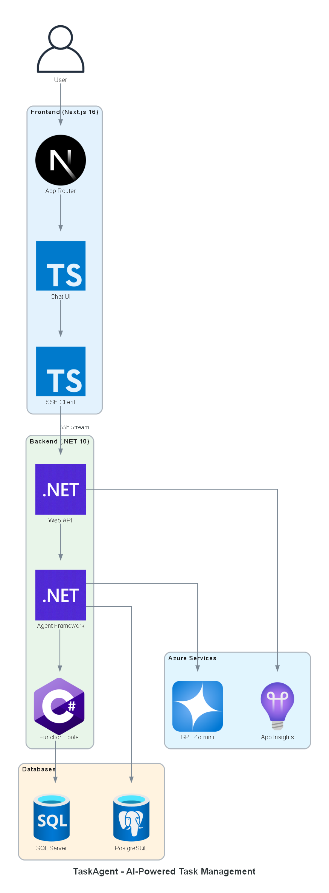
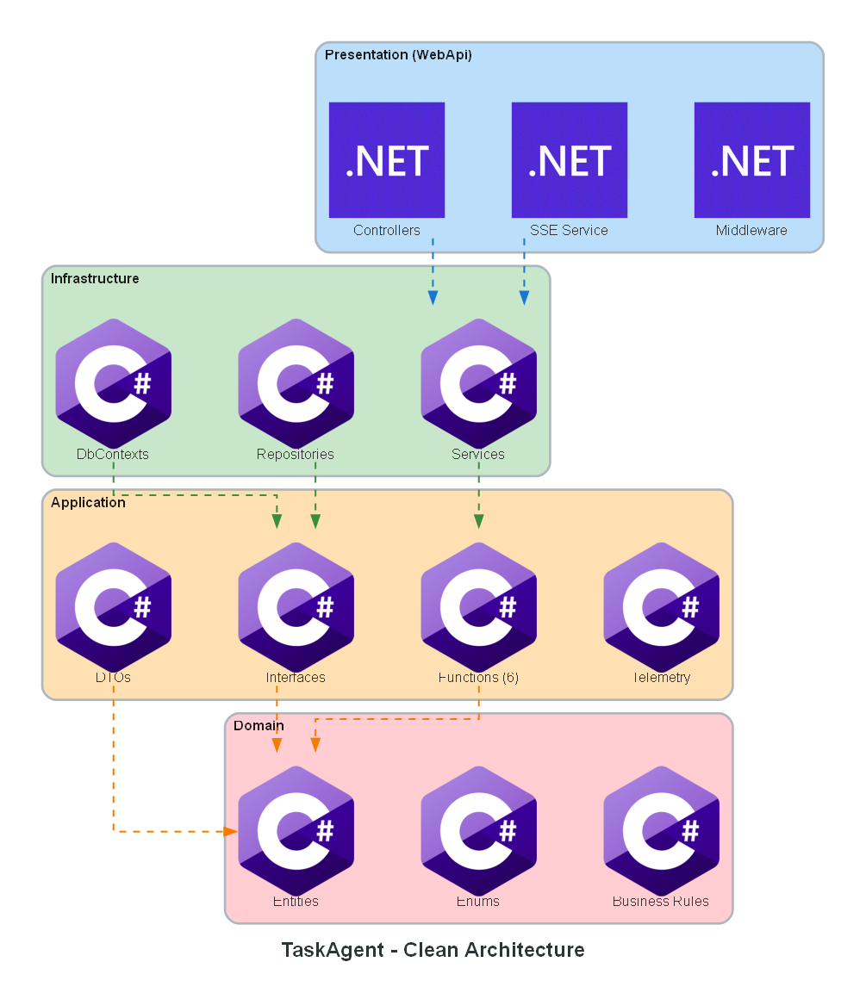
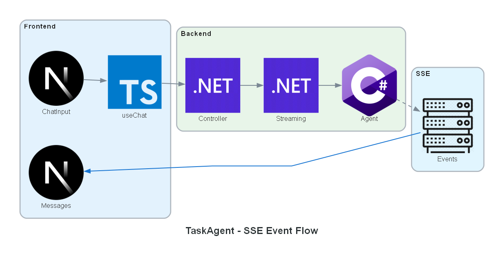
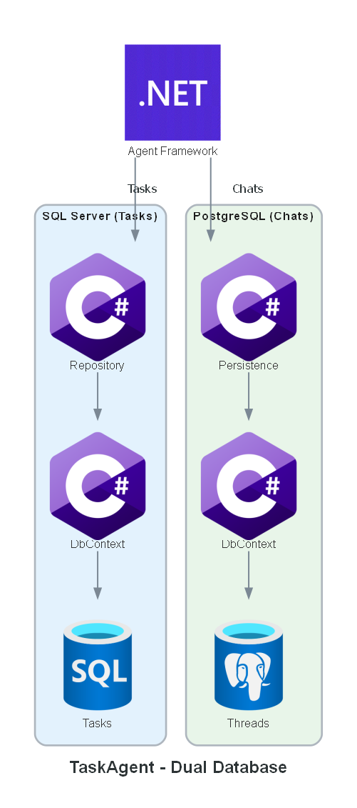
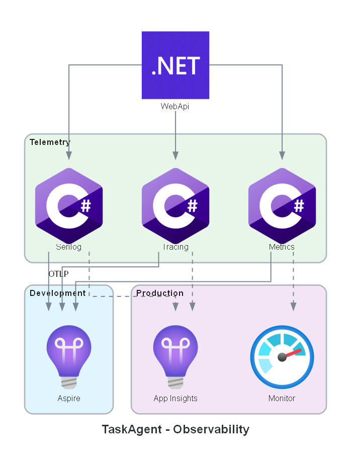
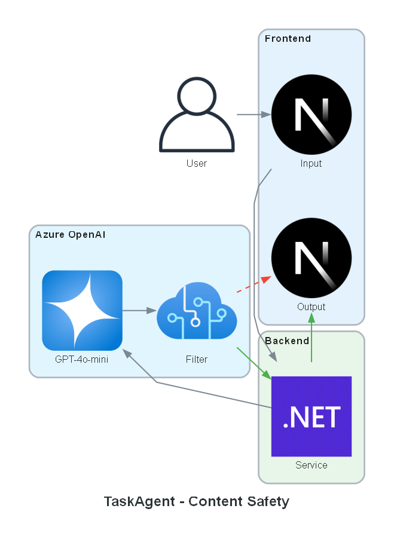

# TaskAgent - Architecture Diagrams

This folder contains architecture diagrams for the TaskAgent AI-powered task management system.

## How to Regenerate

```bash
# Requires: pip install diagrams + Graphviz installed
python scripts/generate_architecture_diagram.py
```

---

## 1. System Overview

**File:** `architecture-main.png`



High-level view of the complete system showing:

- **Frontend**: Next.js 16 with React 19, TypeScript components, and SSE client
- **Backend**: .NET 10 with ASP.NET Core Web API, Microsoft Agent Framework, and function tools
- **Databases**: SQL Server for tasks, PostgreSQL for conversations
- **Azure Services**: Azure OpenAI (GPT-4o-mini) and Application Insights

---

## 2. Clean Architecture Layers

**File:** `architecture-clean.png`



Backend layer organization following Clean Architecture principles:

| Layer | Project | Responsibility |
|-------|---------|----------------|
| **Presentation** | TaskAgent.WebApi | Controllers, SSE streaming, middleware, DI configuration |
| **Infrastructure** | TaskAgent.Infrastructure | DbContexts, repositories, external services |
| **Application** | TaskAgent.Application | DTOs, interfaces, function tools (6), telemetry |
| **Domain** | TaskAgent.Domain | Entities, enums, business rules (NO dependencies) |

**Dependency Rule**: Dependencies flow downward only. Domain layer has zero external dependencies.

---

## 3. SSE Event Flow

**File:** `architecture-sse-flow.png`



Server-Sent Events (SSE) streaming between frontend and backend:

1. **ChatInput** → User types message
2. **useChat Hook** → Sends POST request with `serializedState`
3. **Controller** → AgentController receives request
4. **Streaming** → AgentStreamingService processes
5. **Agent** → ChatClientAgent generates response
6. **SSE Events** → Stream back to frontend
7. **Messages** → Display in MessagesList

**SSE Event Types:**
- `TEXT_MESSAGE_START` / `TEXT_MESSAGE_CONTENT` / `TEXT_MESSAGE_END`
- `TOOL_CALL_START` / `TOOL_CALL_RESULT`
- `CONTENT_FILTER`
- `THREAD_STATE`

---

## 4. Dual Database Architecture

**File:** `architecture-dual-database.png`



Why two databases?

| Database | Purpose | Reason |
|----------|---------|--------|
| **SQL Server** | Task entities | Structured CRUD, EF Core migrations, strong consistency |
| **PostgreSQL** | Conversation threads | JSON type (not JSONB), preserves property order, `$type` discriminator first |

**Key Insight**: PostgreSQL's `json` type preserves property order, which is required for `System.Text.Json` polymorphic deserialization in Microsoft Agent Framework.

---

## 5. Observability Stack

**File:** `architecture-observability.png`



Three pillars of observability:

| Pillar | Technology | Destination |
|--------|------------|-------------|
| **Logging** | Serilog | Console, File, OpenTelemetry |
| **Tracing** | OpenTelemetry | Aspire Dashboard / App Insights |
| **Metrics** | OpenTelemetry | Aspire Dashboard / Azure Monitor |

**Environments:**
- **Development**: .NET Aspire Dashboard (localhost:17198) via OTLP
- **Production**: Application Insights + Azure Monitor

---

## 6. Content Safety Flow

**File:** `architecture-content-safety.png`



Azure OpenAI built-in content filtering:

| Path | Flow | Result |
|------|------|--------|
| ✅ **Safe** | User → Input → Service → OpenAI → Filter → Service → Output | Normal response |
| ❌ **Blocked** | User → Input → Service → OpenAI → Filter → Output (direct) | CONTENT_FILTER SSE event |

**Filter Categories:**
- Hate speech
- Violence
- Sexual content
- Self-harm
- Jailbreak detection (prompt injection)

**Security**: Blocked content is never persisted to database.

---

## Related Documentation

- [Main README](../../README.md) - Project overview
- [Backend README](../../src/backend/services/TaskAgent/README.md) - API documentation
- [Frontend README](../../src/frontend/task-agent-web/README.md) - UI documentation
- [Dual Database Architecture](../DUAL_DATABASE_ARCHITECTURE.md) - Detailed rationale
- [Content Safety](../CONTENT_SAFETY.md) - Testing guide
- [Lessons Learned](../LESSONS_LEARNED.md) - Project patterns
