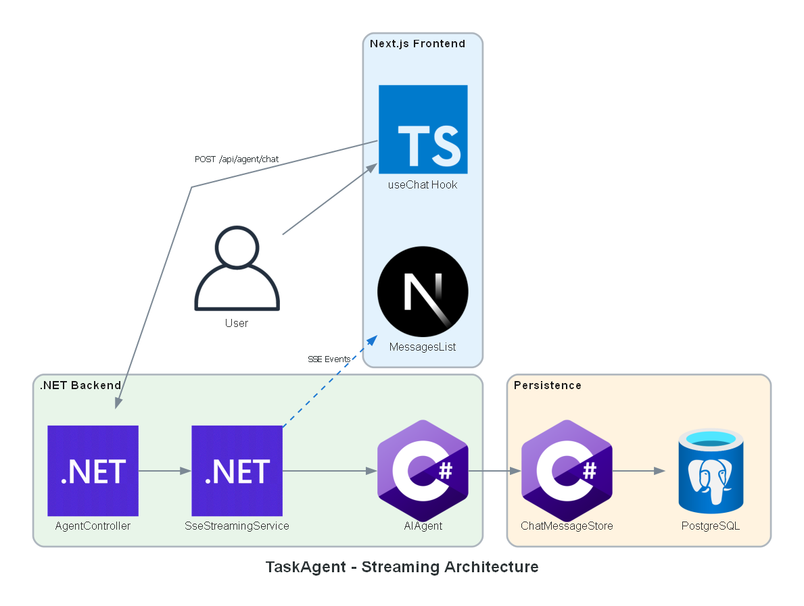
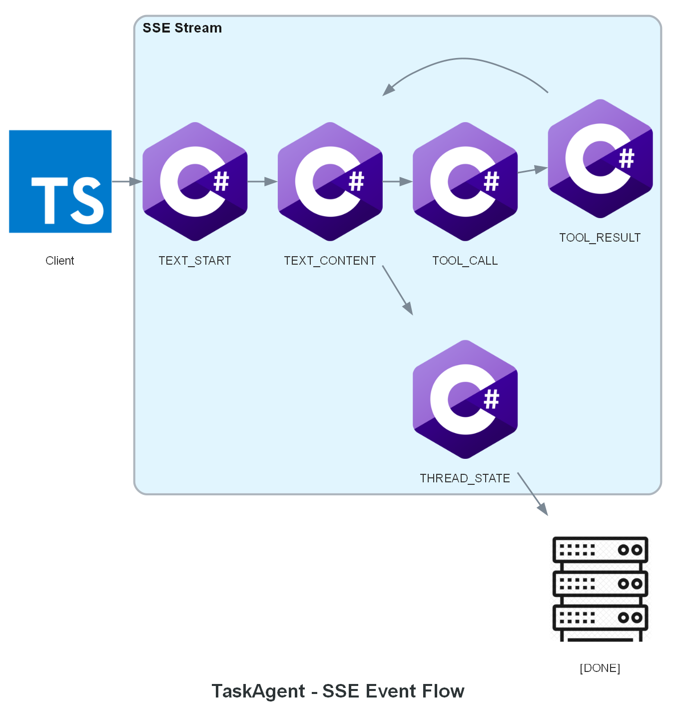
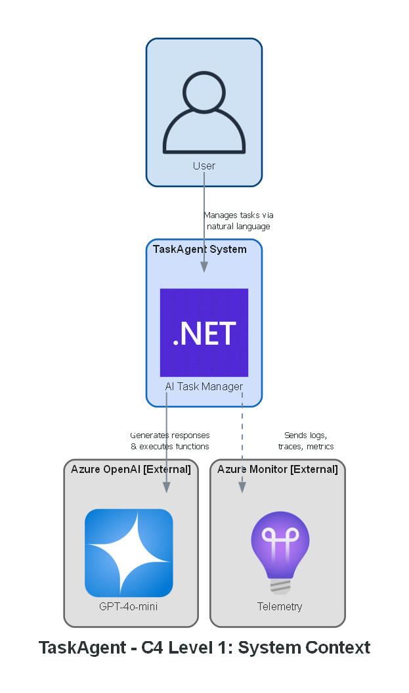
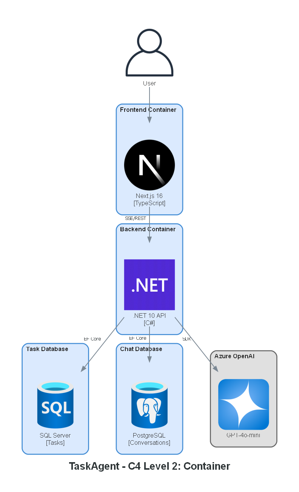
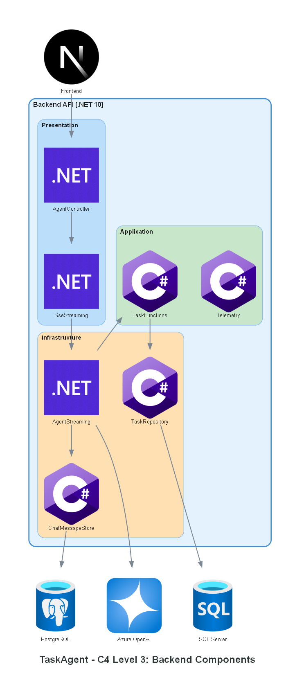

# TaskAgent - Architecture Diagrams

This folder contains architecture diagrams for the TaskAgent AI-powered task management system.

## How to Regenerate

```bash
# Requires: pip install diagrams + Graphviz installed
python scripts/generate_architecture_diagram.py
```

**Generated diagrams (11 total):**

### Architecture Diagrams

| File | Description |
|------|-------------|
| `architecture-main.png` | Main system overview |
| `architecture-clean.png` | Clean Architecture layers |
| `architecture-sse-flow.png` | SSE event streaming (simplified) |
| `architecture-dual-database.png` | SQL Server + PostgreSQL |
| `architecture-observability.png` | OpenTelemetry + Aspire |
| `architecture-content-safety.png` | Azure OpenAI filtering |
| `architecture-streaming.png` | Detailed streaming architecture |
| `architecture-event-types.png` | SSE event types sequence |

### C4 Model Diagrams

Based on [C4 Model](https://c4model.com/) - a standardized way to visualize software architecture.

| File | Level | Description |
|------|-------|-------------|
| `c4-1-context.png` | Level 1: Context | System in relation to users and external services |
| `c4-2-container.png` | Level 2: Container | Technical building blocks (Frontend, Backend, DBs) |
| `c4-3-component-backend.png` | Level 3: Component | Components inside the .NET Backend |

---

## 1. System Overview

**File:** `architecture-main.png`


High-level view of the complete system showing:

- **Frontend**: Next.js 16 with React 19, TypeScript components, and SSE client
- **Backend**: .NET 10 with ASP.NET Core Web API, Microsoft Agent Framework, and function tools
- **Databases**: SQL Server for tasks, PostgreSQL for conversations
- **Azure Services**: Azure OpenAI (GPT-4o-mini) and Application Insights

---

## 2. Clean Architecture Layers

**File:** `architecture-clean.png`


Backend layer organization following Clean Architecture principles:

| Layer | Project | Responsibility |
|-------|---------|----------------|
| **Presentation** | TaskAgent.WebApi | Controllers, SSE streaming, middleware, DI configuration |
| **Infrastructure** | TaskAgent.Infrastructure | DbContexts, repositories, external services |
| **Application** | TaskAgent.Application | DTOs, interfaces, function tools (6), telemetry |
| **Domain** | TaskAgent.Domain | Entities, enums, business rules (NO dependencies) |

**Dependency Rule**: Dependencies flow downward only. Domain layer has zero external dependencies.

---

## 3. SSE Event Flow

**File:** `architecture-sse-flow.png`


Server-Sent Events (SSE) streaming between frontend and backend:

1. **ChatInput** → User types message
2. **useChat Hook** → Sends POST request with `serializedState`
3. **Controller** → AgentController receives request
4. **Streaming** → AgentStreamingService processes
5. **Agent** → ChatClientAgent generates response
6. **SSE Events** → Stream back to frontend
7. **Messages** → Display in MessagesList

**SSE Event Types:**
- `TEXT_MESSAGE_START` / `TEXT_MESSAGE_CONTENT` / `TEXT_MESSAGE_END`
- `TOOL_CALL_START` / `TOOL_CALL_RESULT`
- `CONTENT_FILTER`
- `THREAD_STATE`

---

## 4. Dual Database Architecture

**File:** `architecture-dual-database.png`


Why two databases?

| Database | Purpose | Reason |
|----------|---------|--------|
| **SQL Server** | Task entities | Structured CRUD, EF Core migrations, strong consistency |
| **PostgreSQL** | Conversation threads | JSON type (not JSONB), preserves property order, `$type` discriminator first |

**Key Insight**: PostgreSQL's `json` type preserves property order, which is required for `System.Text.Json` polymorphic deserialization in Microsoft Agent Framework.

---

## 5. Observability Stack

**File:** `architecture-observability.png`


Three pillars of observability:

| Pillar | Technology | Destination |
|--------|------------|-------------|
| **Logging** | Serilog | Console, File, OpenTelemetry |
| **Tracing** | OpenTelemetry | Aspire Dashboard / App Insights |
| **Metrics** | OpenTelemetry | Aspire Dashboard / Azure Monitor |

**Environments:**
- **Development**: .NET Aspire Dashboard (localhost:17198) via OTLP
- **Production**: Application Insights + Azure Monitor

---

## 6. Content Safety Flow

**File:** `architecture-content-safety.png`


Azure OpenAI built-in content filtering:

| Path | Flow | Result |
|------|------|--------|
| ✅ **Safe** | User → Input → Service → OpenAI → Filter → Service → Output | Normal response |
| ❌ **Blocked** | User → Input → Service → OpenAI → Filter → Output (direct) | CONTENT_FILTER SSE event |

**Filter Categories:**
- Hate speech
- Violence
- Sexual content
- Self-harm
- Jailbreak detection (prompt injection)

**Security**: Blocked content is never persisted to database.

---

## 7. Streaming Architecture

**File:** `architecture-streaming.png`



Detailed view of the SSE streaming implementation:

| Component | Layer | Responsibility |
|-----------|-------|----------------|
| **useChat Hook** | Frontend | Manages state, sends requests, processes SSE callbacks |
| **MessagesList** | Frontend | Renders messages with progressive text updates |
| **AgentController** | Backend | Entry point, configures SSE headers |
| **SseStreamingService** | Backend | Orchestrates streaming to HTTP response |
| **AIAgent** | Backend | Microsoft Agent Framework with function tools |
| **ChatMessageStore** | Persistence | Factory pattern for PostgreSQL persistence |

---

## 8. SSE Event Types

**File:** `architecture-event-types.png`



SSE event sequence during a typical chat interaction:

| Order | Event | Purpose |
|-------|-------|---------|
| 1 | Request (`POST`) | Client sends message with `serializedState` |
| 2 | `MSG_START` | Streaming begins, includes `messageId` |
| 3 | `MSG_CONTENT` | Text chunks (delta updates) |
| 4 | `TOOL_CALL` | Function tool invoked |
| 5 | `TOOL_RESULT` | Function returns result |
| 6 | `THREAD_STATE` | Updated state for next request |
| 7 | `[DONE]` | Stream complete |

**Special events:** `CONTENT_FILTER` (blocked content), `RUN_ERROR` (execution failure)

---

# C4 Model Diagrams

The [C4 Model](https://c4model.com/) provides a standardized way to visualize software architecture at different levels of abstraction.

## 9. C4 Level 1: System Context

**File:** `c4-1-context.png`



Shows TaskAgent in relation to its users and external systems:

| Element | Type | Description |
|---------|------|-------------|
| **User** | Person | End user who manages tasks via natural language |
| **TaskAgent** | System | AI-powered task management application |
| **Azure OpenAI** | External | GPT-4o-mini for AI responses and function calling |
| **Azure Monitor** | External | Application Insights for telemetry |

---

## 10. C4 Level 2: Container

**File:** `c4-2-container.png`



Technical building blocks of the system:

| Container | Technology | Purpose |
|-----------|------------|---------|
| **Frontend** | Next.js 16 / TypeScript | React UI with SSE streaming |
| **Backend** | .NET 10 / C# | REST API + Agent Framework |
| **Task DB** | SQL Server | CRUD operations for tasks |
| **Chat DB** | PostgreSQL | Conversation thread persistence |

---

## 11. C4 Level 3: Backend Components

**File:** `c4-3-component-backend.png`



Components inside the .NET Backend (Clean Architecture):

| Component | Layer | Responsibility |
|-----------|-------|----------------|
| **AgentController** | Presentation | HTTP entry point, SSE configuration |
| **SseStreaming** | Presentation | Orchestrates streaming to HTTP response |
| **TaskFunctions** | Application | 6 function tools for task operations |
| **Telemetry** | Application | OpenTelemetry metrics and traces |
| **AgentStreaming** | Infrastructure | Agent Framework integration |
| **TaskRepository** | Infrastructure | SQL Server data access |
| **ChatMessageStore** | Infrastructure | PostgreSQL persistence |

---

## Related Documentation

- [Main README](../../README.md) - Project overview
- [Backend README](../../src/backend/services/TaskAgent/README.md) - API documentation
- [Frontend README](../../src/frontend/task-agent-web/README.md) - UI documentation
- [Dual Database Architecture](../DUAL_DATABASE_ARCHITECTURE.md) - Detailed rationale
- [Content Safety](../CONTENT_SAFETY.md) - Testing guide
- [Lessons Learned](../LESSONS_LEARNED.md) - Project patterns
